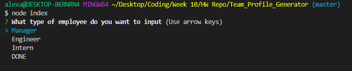
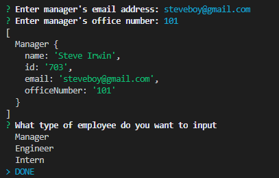
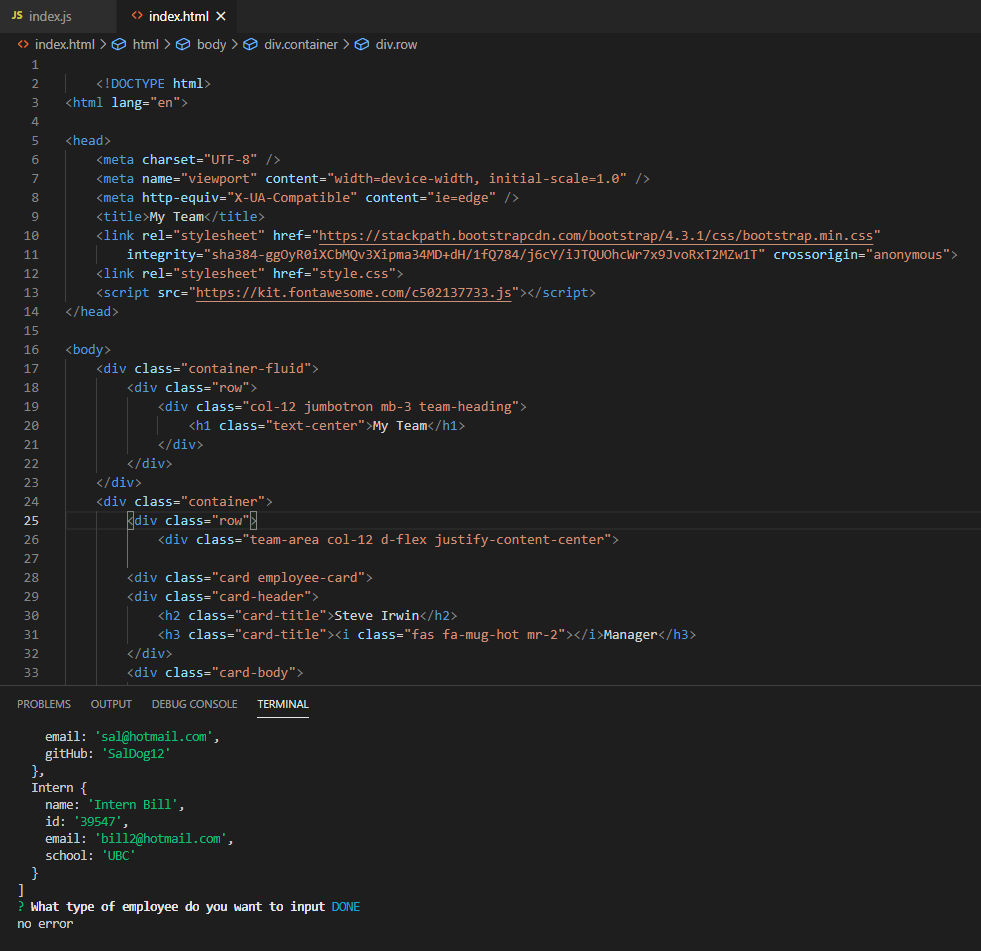
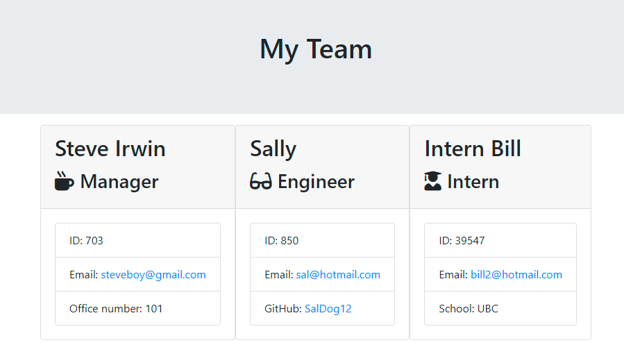

## Description: 

#### Team Profile Generator: Command-line application that accepts user input to automatically generate an HTML webpage displaying bootstrap cards with details of each employee (Manager, Engineer, Intern).  Utilizing NPM- Jest, Inquirer.

#### Initial submission date of 1/27/2021

## Screenshots:
 

## Links: 

#### GitHub Repository: https://github.com/awoolley1/Team_Profile_Generator

#### Screencapture Link: "add video link"

## Author: 

#### Alex Woolley; https://github.com/awoolley1; alexander.s.woolley@gmail.com
